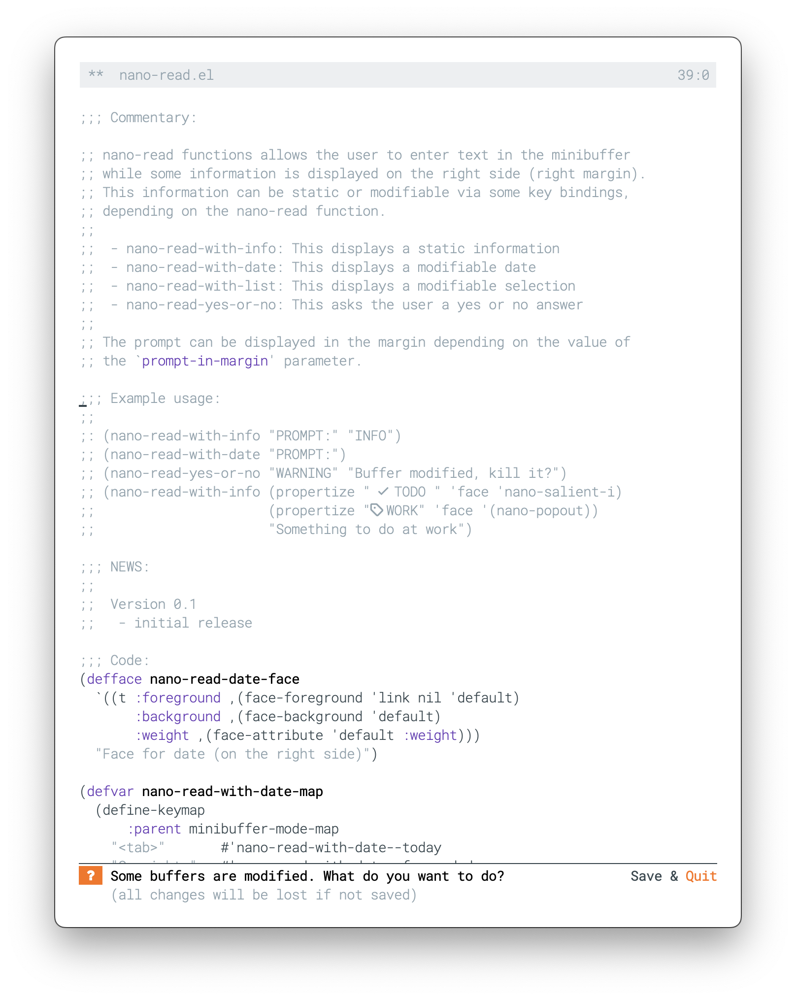

## N Λ N O read

nano-read functions allow the user to enter text in the minibuffer
while some information is displayed on the right side (right margin).
This information can be static or modifiable via some key bindings,
depending on the nano-read function.

 - nano-read-with-info: This displays a static information
 - nano-read-with-date: This displays a modifiable date
 - nano-read-with-list: This displays a modifiable selection
 - nano-read-yes-or-no: This asks the user a yes or no answer

## Example

```lisp
(nano-read-with-info "PROMPT:" "INFO")
```

```lisp
(nano-read-yes-or-no "WARNING" "Buffer modified, kill it?")
```

## Screenshort


